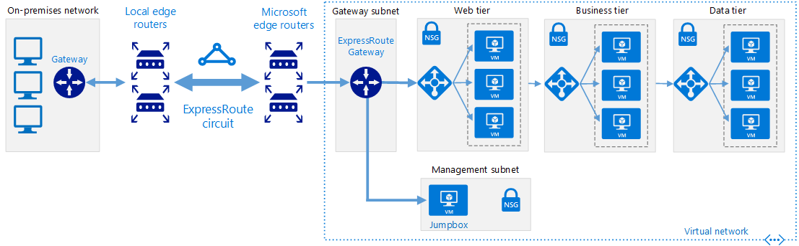
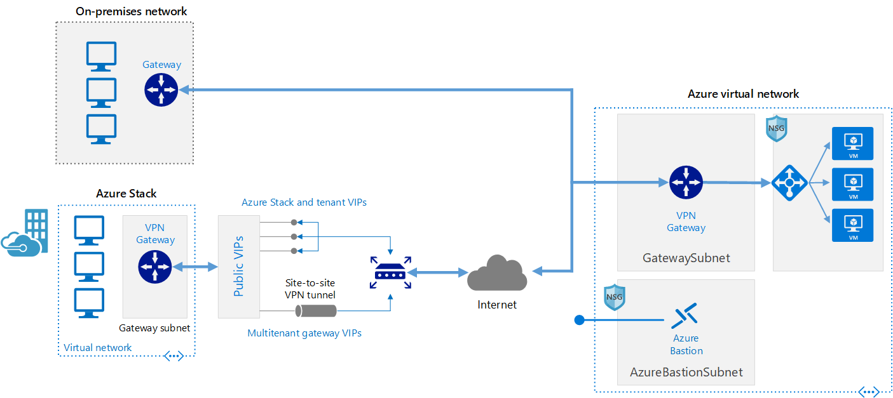
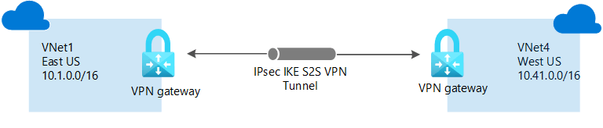
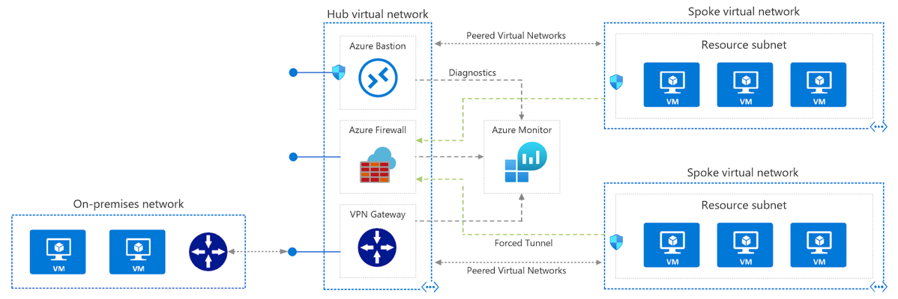

# Azure networking

## Express route

### Definition

https://docs.microsoft.com/en-us/azure/expressroute/expressroute-introduction

> **ExpressRoute lets you extend your on-premises networks into the Microsoft cloud** over a **private connection** with the help of a connectivity provider. With ExpressRoute, you can establish connections to Microsoft cloud services, such as Microsoft Azure and Microsoft 365.
> Connectivity can be from an any-to-any (IP VPN) network, a point-to-point Ethernet network, or a virtual cross-connection through a connectivity provider at a colocation facility. **ExpressRoute connections don't go over the public Internet**. This allows ExpressRoute connections to offer more reliability, faster speeds, consistent latencies, and higher security than typical connections over the Internet. For information on how to connect your network to Microsoft using ExpressRoute, see ExpressRoute connectivity models.

We need a partner suc as Equinix, Telefonica, Verizon...
https://docs.microsoft.com/fr-fr/azure/expressroute/expressroute-locations

See also architecture: 
https://docs.microsoft.com/en-us/azure/architecture/reference-architectures/hybrid-networking/expressroute

Note we also have gateway for express route.

### Architecture

Here are components

> **On-premises corporate network**. A private local-area network running within an organization.

> **ExpressRoute circuit**. A layer 2 or layer 3 circuit supplied by the connectivity provider that joins the on-premises network with Azure through the edge routers. The circuit uses the hardware infrastructure managed by the connectivity provider.

> **Local edge routers**. Routers that connect the on-premises network to the circuit managed by the provider. Depending on how your connection is provisioned, you may need to provide the public IP addresses used by the routers.

> **Microsoft edge routers**. Two routers in an active-active highly available configuration. These routers enable a connectivity provider to connect their circuits directly to their datacenter. Depending on how your connection is provisioned, you may need to provide the public IP addresses used by the routers.

> **Azure virtual networks (VNets)**. Each VNet resides in a single Azure region, and can host multiple application tiers. Application tiers can be segmented using subnets in each VNet.

> **Azure public services**. Azure services that can be used within a hybrid application. These services are also available over the Internet, but accessing them using an ExpressRoute circuit provides low latency and more predictable performance, because traffic does not go through the Internet.

## VPN gateway 

### Definition

https://docs.microsoft.com/en-us/azure/vpn-gateway/vpn-gateway-about-vpngateways

> **A VPN gateway is a specific type of virtual network gateway that is used to send encrypted traffic between an Azure virtual network and an on-premises location over the public Internet**. You can also use a VPN gateway to send encrypted traffic between Azure virtual networks over the Microsoft network. Each virtual network can have only one VPN gateway. However, you can create multiple connections to the same VPN gateway. When you create multiple connections to the same VPN gateway, all VPN tunnels share the available gateway bandwidth.

Note with express route gateway

> When you configure a virtual network gateway, you configure a setting that specifies the gateway type. The gateway type determines how the virtual network gateway will be used and the actions that the gateway takes. The gateway type 'Vpn' specifies that the type of virtual network gateway created is a 'VPN gateway'. This distinguishes it from an ExpressRoute gateway, which uses a different gateway type. A virtual network can have two virtual network gateways; one VPN gateway and one ExpressRoute gateway. For more information, see Gateway types.

### Architecture

https://docs.microsoft.com/en-us/azure/architecture/reference-architectures/hybrid-networking/vpn?tabs=portal

> This reference architecture shows how to extend a network from on premises or from Azure Stack into an Azure virtual network, using a site-to-site virtual private network (VPN). Traffic flows between the on-premises network and Azure through an IPSec VPN tunnel or through the Azure Stack multitenant VPN gateway.

The architecture consists of the following components.

> **On-premises network**. A private local-area network running within an organization.

> **Azure Stack**. A network environment on an Azure Stack tenant subscription, running within an organization. The Azure Stack VPN gateway sends encrypted traffic across a public connection to virtual IP (VIP) addresses and includes the following components:
> - Gateway subnet. A special subnet required to deploy the VPN Gateway on Azure Stack.
> - Local network gateway. Indicates the target IP of the VPN gateway in Azure, as well as the address space of the Azure virtual network.
> - Site-to-site VPN tunnel. The connection type (IPSec) and the key shared with the Azure VPN Gateway to encrypt traffic.

> **VPN appliance.** A device or service that provides external connectivity to the on-premises network. The VPN appliance may be a hardware device, or it can be a software solution such as the Routing and Remote Access Service (RRAS) in Windows Server 2012. For a list of supported VPN appliances and information on configuring them to connect to an Azure VPN gateway, see the instructions for the selected device in the article About VPN devices for Site-to-Site VPN Gateway connections.

**Virtual network.** The cloud application and the components for the Azure VPN gateway reside in the same virtual network.

**Azure VPN gateway.** The VPN gateway service enables you to connect the virtual network to the on-premises network through a VPN appliance or to connect to Azure Stack through a site-to-site VPN tunnel. For more information, see Connect an on-premises network to a Microsoft Azure virtual network. The VPN gateway includes the following elements:
> - Virtual network gateway. A resource that provides a virtual VPN appliance for the virtual network. It is responsible for routing traffic from the on-premises network to the virtual network.
> - Local network gateway. An abstraction of the on-premises VPN appliance. Network traffic from the cloud application to the on-premises network is routed through this gateway.
> - Connection. The connection has properties that specify the connection type (IPSec) and the key shared with the on-premises VPN appliance to encrypt traffic.
> - Gateway subnet. The virtual network gateway is held in its own subnet, which is subject to various requirements, described in the Recommendations section below.

> **Cloud application.** The application hosted in Azure. It might include multiple tiers, with multiple subnets connected through Azure load balancers. For more information about the application infrastructure, see Running Windows VM workloads and Running Linux VM workloads.

> **Internal load balancer.** Network traffic from the VPN gateway is routed to the cloud application through an internal load balancer. The load balancer is located in the front-end subnet of the application.

> **Bastion.** Azure Bastion allows you to log into VMs in the virtual network through SSH or remote desktop protocol (RDP) without exposing the VMs directly to the internet. If you lose connectivity through the VPN, you can still use Bastion to manage the VMs in the virtual network.

There are 3 connection supported by VPN:
- site-to-site (here) but we also have: encrypted on public Internet
- point-to-site: encrypted on public Internet
- VNet-to-Vnet (see AZ900 book, page 64): in that case we use Microsoft's backbone infrastructure not over internet and on top of this it is encrypted. 
This should not be confused with VNet peering (described [below](#vnet-peering)). 
See https://docs.microsoft.com/en-us/azure/vpn-gateway/vpn-gateway-howto-vnet-vnet-resource-manager-portal
> This type of configuration creates a connection between two virtual network gateways. This article does not apply to VNet peering

See here for more info on VPN: https://docs.microsoft.com/en-us/azure/vpn-gateway/design
where express route and vnet peering are also mentionned.

## Vnet peering

### Definition

> Virtual network peering enables you to seamlessly connect two or more Virtual Networks in Azure. The virtual networks appear as one for connectivity purposes. The traffic between virtual machines in peered virtual networks uses the **Microsoft backbone infrastructure**. Like traffic between virtual machines in the same network, traffic is routed through Microsoft's private network only.

> Azure supports the following types of peering:

> - Virtual network peering: Connect virtual networks within the same Azure region.
> - Global virtual network peering: Connecting virtual networks across Azure regions.

Note from https://docs.microsoft.com/en-us/azure/vpn-gateway/design
> VNet peering does not use a virtual network gateway. 

## Some wrap-up

- Some design consideration: https://docs.microsoft.com/en-us/azure/vpn-gateway/design
- We can connect VNet-to-Vnet via VPN Site-to-Site (IPsec) and VNet peering: https://docs.microsoft.com/en-us/azure/vpn-gateway/vpn-gateway-vnet-vnet-rm-ps?toc=/azure/virtual-network/toc.json#about
- Use VNet peering or VPN gateway: https://azure.microsoft.com/fr-fr/blog/vnet-peering-and-vpn-gateways/

> VNet Peering provides a low latency, high bandwidth connection useful in scenarios such as cross-region data replication and database failover scenarios. Since traffic is completely private and remains on the Microsoft backbone, customers with strict data policies prefer to use VNet Peering as public internet is not involved. Since there is no gateway in the path, there are no extra hops, ensuring low latency connections.

> VPN Gateways provide a limited bandwidth connection and is useful in scenarios where encryption is needed, but bandwidth restrictions are tolerable. In these scenarios, customers are also not as latency-sensitive.

Also notice VNet peering and express route does not involve public internet.
Unlike VPN.

Article also mentions we can use 

> Gateway transit enables you to use a peered VNet’s gateway for connecting to on-premises instead of creating a new gateway for connectivity. As you increase your workloads in Azure, you need to scale your networks across regions and VNets to keep up with the growth. Gateway transit allows you to share an ExpressRoute or VPN gateway with all peered VNets and lets you manage the connectivity in one place. Sharing enables cost-savings and reduction in management overhead.

This is the concept behind hub-spoke network topology

## Hub-spoke network topology

> This reference architecture details a hub-spoke topology in Azure. The hub virtual network acts as a central point of connectivity to many spoke virtual networks. The hub can also be used as the connectivity point to your on-premises networks. The spoke virtual networks peer with the hub and can be used to isolate workloads.

> The benefits of using a hub and spoke configuration include cost savings, overcoming subscription limits, and workload isolation.

The architecture consists of the following components.

**Hub virtual network:** The hub virtual network is the central point of connectivity to your on-premises network. It's a place to host services that can be consumed by the different workloads hosted in the spoke virtual networks.

**Spoke virtual networks:** Spoke virtual networks are used to isolate workloads in their own virtual networks, managed separately from other spokes. Each workload might include multiple tiers, with multiple subnets connected through Azure load balancers.

**Virtual network peering:** Two virtual networks can be connected using a peering connection. Peering connections are non-transitive, low latency connections between virtual networks. Once peered, the virtual networks exchange traffic by using the Azure backbone without the need for a router.

**Bastion Host:** Azure Bastion lets you securely connect to a virtual machine using your browser and the Azure portal. An Azure Bastion host is deployed inside an Azure Virtual Network and can access virtual machines in the VNet, or virtual machines in peered VNets.

**Azure Firewall:** Azure Firewall is a managed firewall as a service. The Firewall instance is placed in its own subnet.

**VPN virtual network gateway or ExpressRoute gateway.** The virtual network gateway enables the virtual network to connect to the VPN device, or ExpressRoute circuit, used for connectivity with your on-premises network. For more information, see Connect an on-premises network to a Microsoft Azure virtual network.

**VPN device.** A device or service that provides external connectivity to the on-premises network. The VPN device may be a hardware device or a software solution such as the Routing and Remote Access Service (RRAS) in Windows Server 2012. For more information, see About VPN devices for Site-to-Site VPN Gateway connections.
Recommendations

Note here we use
- VNet peering
- VPN or express route gateway
(not experess route does not need a device but gateway can be of type VPN or ExpressRoute)

Assume we leverage a partner (in particular when using ExpressRoute) such as  Equinix, Telefonica, Verizon...(it is a [PoP](https://fr.wikipedia.org/wiki/Point_of_Presence)) to target hub.

We need to secure connexion between client (on-premise can be a customer or own dc) and partner (PoP) to traget Azure.
<!-- doubt here but ok -->

For this we can leverage a VPN between client and partner (PoP).

<!-- OK CCL -->

## Azure firewall vs nsg

https://www.svenmalvik.com/azure-nsg-vs-firewall/

NSG:
> Azure Network Security Groups (NSGs) is an OSI layer 3 & 4 network service for refining traffic to and from an Azure Virtual Network (VNet). They can be associated with subnets or network interfaces of Azure VMs.

> We use NSGs for protecting incoming and outgoing traffic of a subnet. 

Firewall: 
> This managed firewall service can filter and analyze OSI layer 3, 4 and 7 traffic
> It has the ability to process traffic across subscriptions and VNets that are deployed in a hub-spoke model
> Azure Firewall is the service for filtering traffic to a VNet from the outside-world. It should be deployed in it’s own VNet and be isolated from other Azure resources.
