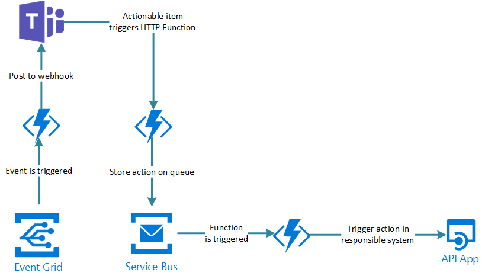

# Cloud provider compute service overview

## Overview 

| Layer                       | Compute                                                               |
| --------------------------- | ----------------------------------------------------------------------|
| IaaS                        | **Azure VM**, AWS EC2                                                 |
| PaaS with @ to managed nodes| **Azure AKS**, AWS EK(8s)S, AWS EC(container)S,  AWS elasticbeanstalk |
| PaaS with node farm but no @| **Azure App svc**, **Azure function with App Service plan**                                                     |                              
| Serverless                  | **Azure ACI (container instance)**, Fargate AWS EKS, Fargate AWS ECS, Google cloud run |
| FaaS                        | **Azure function**, AWS lambda, **Azure logic Apps**                   |                                    

## Comments

- Note several serverless service have a cold start (close to FaaS)

- Azure App Service is a PaaS with no access to managed nodes: https://docs.microsoft.com/en-us/azure/app-service/overview
> With App Service, you pay for the Azure compute resources you use. The compute resources you use are determined by the App Service plan that you run your apps on. For more information, see Azure App Service plans overview.
We have concept of App Service Plan: https://docs.microsoft.com/en-us/azure/app-service/overview-hosting-plans
> In App Service (Web Apps, API Apps, or Mobile Apps), an app always runs in an App Service plan. In addition, Azure Functions also has the option of running in an App Service plan. An App Service plan defines a set of compute resources for a web app to run. These compute resources are analogous to the server farm in conventional web hosting (behind we have VM and configure their size).
Similar to AWS elasticbeanstalk but here we have access to Nodes
https://docs.aws.amazon.com//latest/dg/using-features.ec2connect.html

- AWS Elastic Beanstalk(https://docs.aws.amazon.com/elasticbeanstalk/latest/dg/create_deploy_docker.html) and [Azure app service]( https://azure.microsoft.com/en-us/services/app-service/containers/#demo) both supports Docker and are similar services.

- Proof we have access to ec2 instance when not [using Fargate](#AWS_Fargate) in AWS EKS and ECS
https://docs.aws.amazon.com/AmazonECS/latest/developerguide/instance-connect.html
https://docs.aws.amazon.com/eks/latest/userguide/eks-compute.html

This quotes shows nodes are managed
> Yes – If you deployed an Amazon EKS optimized AMI, then you're notified in the Amazon EKS console when updates are available and can perform the update with one click in the console. If you deployed a custom AMI, then you're not notified in the Amazon EKS console when updates are available and must perform the update yourself

- AWS ECS and AWS EKS are available with FARGATE.
- https://aws.amazon.com/about-aws/whats-new/2019/12/run-serverless-kubernetes-pods-using-amazon-eks-and-aws-fargate/?nc1=h_ls
- https://docs.aws.amazon.com/AmazonECS/latest/developerguide/AWS_Fargate.html
Unlike AWS ECS and EKS without Fargate we have no access to EC2 instance behind.

Fargate AWS ECS (https://aws.amazon.com/ecs/?nc1=h_ls) and Azure container instance (https://azure.microsoft.com/en-us/services/container-instances/#overview) and Google cloud run are similar. Those are serverless CaaS.

- Azure ACI is serverless https://docs.microsoft.com/en-us/azure/container-instances/ unlike Azure AKS, see https://docs.microsoft.com/fr-fr/azure/aks/ssh 
If we deploy AKS we will have a VM scale set and can connect to VM (it is not visible in VM azure console)

- Note Azure ACI we have resource requirement (https://portal.azure.com/#create/Microsoft.ContainerInstances) (it is not really a VM size. AZ900 exam prep book is not 100% accurate, p56) wheras an app service plan we talk about instance (see settings of exisiting svc plan) => difference between "PaaS with node farm but no @ccess" vs "serverless".  

- Here Fargate vs Lambda ([or serverless vs FaaS](./1-cloud_iass-pass-saas#From-IasS-to-serverless-PaaS)).

From https://www.trek10.com/blog/is-fargate-serverless
> Don’t let the word “serverless” confuse you: Fargate is fundamentally just less infrastructure; Lambda-based “serverless” confers benefits to your business on a scale that Fargate simply can’t touch.

- We can consider Azure function as [serverless FaaS](./1-cloud_iass-pass-saas#From-IasS-to-serverless-PaaS).

 This is compliant with [Azure function doc](https://docs.microsoft.com/en-us/azure/azure-functions/functions-create-function-app-portal0:
> Hosting plan that defines how resources are allocated to your function app:
> In the default Consumption plan, resources are added dynamically as required by your functions. In this serverless hosting, you pay only for the time your functions run. 

But it is also possible to have Azure function attached to an App Service plan 

> When you run in an App Service plan, you must manage the scaling of your function app.

In that case we have a "PaaS with node farm but no @ccess", 
from  [definition given here](./1-cloud_iass-pass-saas#From-IasS-to-serverless-PaaS) , since using App service plan we scale dedicated VM directly and nodes constantly runs.

See also AZ900 book, p123

> Function apps are serveless, but under the hood, they run on Azure app service. In fact you can choose to create your Function App in App service plan, but if you di, you won't benerfit from the consumption model of paying only when your code runs.

However even if you have dedicated VM with App Service plan when no function is running it should not consume you App service plan.
So it is a if we were doing serverless on our own resource (rather than shared with global Azure infra).
See section [below](#Build-a-serverless-service-on-top-of-kubenertes).

- Note managed services can deploy other resources:
App service deploy app service plan,  log analytics workspace, application insigths.
AKS deployd ip address,nsg, route table, vm scale set (even when nodes are fixed), vnet, Solution (container insight for logs), load balancer, netowrk watcher, managed identity x2, k8s svc. ACI deploy only container instance. 

## A note on Azure compute service

Azure service ps course: https://app.pluralsight.com/library/courses/microsoft-azure-services-concepts/exercise-files => Exploring Azure core product

Azure compute has (slide 3)
- Virtual machine ==> IaaS
    - We managed node but can use template image (we will have to manage nodes, patch etc)
    - it is a pay as you go model
- Containers (PaaS, CaaS)
    - AKS (we can access nodes (VM scale set) but they are managed by platform including software patch, it is not serverless)
    - ACI (serverless CaaS: we can NOT access nodes and they are managed for us)
        - https://medium.com/asos-techblog/serverless-on-azure-b12bc282304a
        - https://docs.microsoft.com/en-us/azure/container-instances/container-instances-overview
- Azure App Service ==> PAAS,
    - they have a non serverless [CAAS feature]( https://azure.microsoft.com/en-us/services/app-service/containers/#demo)
- Serverless computing ==> FaaS (functions, logic apps)

So container can be run in 
- local workstation
- on premise server
- VM in Azure
- ACI 
- AKS
- Azure APP service

and it can be kube/docker compose in first 3 options

## Build a serverless service on top of kubenertes

- OpenFaaS => show we have a server on provider side when doing serverless!
- Launch a docker via job API 
- kNative: serverless where function is the container and scaling to 0: https://knative.dev/docs/getting-started/first-autoscale/

## Example of Azure serverless integration: function + event grid 

Excellent example here to send email with Azure function here: https://jan-v.nl/post/using-azure-functions-to-empower-your-teams/

> create so-called ‘actionable messages’ within Teams?
> An actionable message can be created with a couple of buttons which will invoke an URL when pressed. 

> Over here you’re seeing an Event Grid, which contains events of stuff happening in your overall Azure solution. An Azure Function is subscribed to a specific topic and once it’s triggered a message is being posted on the Teams channel. This can be an actionable message or a plain message.
> If it’s an actionable message, a button can be pressed which in its turn also sends a GET-request to a different Azure Function. You want this Function to be fast, so the only thing it does is validate the request and stores the message (command) on a (Service Bus) queue. A different Azure Function will be triggered, which will make sure the command will be executed properly by invoking an API/service which is responsible for ‘solving’ the issue.

Here it is an EDA with Lambda serverless: https://www.redhat.com/en/topics/integration/what-is-event-driven-architecture

Mote on EDA here: https://www.redhat.com/en/topics/integration/what-is-event-driven-architecture

See also Kafka very good course [on pluralsigth](https://app.pluralsight.com/library/courses/apache-kafka-getting-started/table-of-contents).

We can also send mail with serverles approach using with **Azure logic apps** 
<!-- MAES is equivalent serverless service on top of conductor -->
We would use the [team connectors](https://docs.microsoft.com/en-us/connectors/teams/).
It would also enable to easily do other action (service now....).
See good tuto in Microsoft [doc site](https://docs.microsoft.com/en-us/azure/app-service/tutorial-send-email?tabs=dotnet).

<!-- DDez discussion + run -->

See AZ900, p122 for serverless service

## Logic app is not really a compute service

https://walkerscott.co/2020/03/azure-logic-apps-vs-azure-functions/

## Quarkus

Quarkus can so serverless/FaaS: https://quarkus.io/vision/continuum (not here they consider it as [synonym](#From-IaaS-to-diffferent-level-of-PaaS)).
And it operates
> to various FaaS environments like AWS Lambda, Azure Functions, Knative, and Knative Events (Cloud Events). It is also usable as a standalone service.

Not the "It is also usable as a standalone service.", it is less serverless in that case from defnition [here](#Serverless):https://en.wikipedia.org/wiki/Serverless_computing

<!-- AMOR discussion -->

## other notes

- See also https://github.com/scoulomb/myPublicCloud/blob/master/AWS/1-microservice-on-aws-notes.md (checked and accurate)
- AWS service overview: https://docs.aws.amazon.com/whitepapers/latest/aws-overview/introduction.html 

[Next: cloud database and storage overview](3-cloud-db-overview.md)
