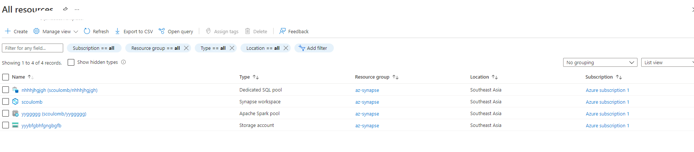

# Platform solutions
<!-- 1,2,3,4 concluded --> 

Ressource: 
- https://app.pluralsight.com/library/courses/microsoft-azure-services-concepts/table-of-contents
- AZ900 book, chapter 3 (skills 3.1 describe core solutions available in Azure)

## Big Data

### Azure Synapse

From AZ900 book, p105
4 differents components
- Synapse SQL (data warehousing option)
- Apache Spark integration 
- Data integration of Spark and Azure Data Lake Storage
- a web-based user interface called Azure Synapse Studio

Queries are executed in compute nodes.
Data is stored in a built-in SQL serverless pool (it will not appear in your "all ressources" list, we have a synapse workspace and storage account )
=>  Similar to [serverless tier](3-cloud-db-overview.md#Azure-SQL-database).

From Synapse wokrspace (ressource) We can create 
- new dedicated SQL pool: in that case it will appear as a SQL dedicated pool in all ressource. It is a product for Synapse Analystics
https://docs.microsoft.com/en-us/azure/synapse-analytics/sql-data-warehouse/sql-data-warehouse-overview-what-is
=>  Similar to [provisionned tier](3-cloud-db-overview.md#Azure-SQL-database)
-  new Apache Spark pool: note increation process we select number of nodes (no servereless).
The pool does actually in all ressource.
We can scale after number of node in the pool but we can not access to VM.
=> [PaaS with node farm but no @ccess](1-cloud_iass-pass-saas.md#From-IaaS-to-diffferent-level-of-PaaS).
- New Apache explore pool

.

Thus we have new ressource created leveraged by Synapse but no direct access to underlying VMs.

### HDInsigth 

Azure managed service (cloud implem) of open source service (Hadoop).
It supports cluster of type:
- Hadoop
- HBase
- Storm
- Spark 
- Interactive Query (Hive)
- RServer
- Kafka

### Databrick

Cloud implem of Spark.
It includes [Spark notebook](https://github.com/spark-notebook/spark-notebook) (similar to Jupyter).

AZ900 book, page 113
> Databrick uses a serverless miodel if computing. That means that when you are not running any jobs, you don't have any VMs or compute ressource assigned to you. When you run ajob, Azure will allocate VMs to your cluster temporarily in order to process that job. Once the job is compltete, it releases those resources.
=> [Serverless](1-cloud_iass-pass-saas.md#From-IaaS-to-diffferent-level-of-PaaS).

<!-- 3  questions resolved + big data concluded -->
<!-- all above ok -->
<!-- Azure function concluded and juge consistent OK RECCL->

## Machine learning

## Cognitive service 

It is a SaaS ML (p119) => SaaS or PaaS for service below ask ourself question

## Bot service 

## Iot

- IoT Hub
- IoT Central
- Azure Sphere

## Serverless

- Azure function, logic apps and event grid

## DevOps solutions (separted from solution in pluralsigth)

- Azure devops
- Azure devtest labs
- github tools

What to do after?
- pluralsigh aws core service tra exam
- ps azure finish the service+sec course
- exam bank in ps, esi
- AZ book

We can consider APIM is close to serverless 
[Azure, APIM, k8s, Kafka and DAPR integration](../Azure/Azure-APIM-k8s-Kafkapubsub-and-DAPR-integration.md).

Add pub priv cloud and public cloud for a given industry

[Network basic](../Azure/Networking/basic.md) => CONCLUDED, 
Next: check az900 book and going further via 
+ https://docs.microsoft.com/en-us/azure/networking/fundamentals/networking-overview
+ https://docs.microsoft.com/en-us/learn/certifications/exams/az-303 => https://docs.microsoft.com/en-us/learn/paths/architect-network-infrastructure/

<!-- postpone exam -->