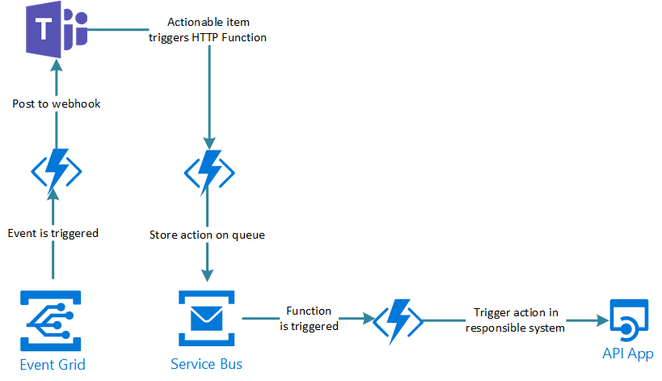

# Cloud computing IaaS,PaaS, SaaS

## Basic definition

- OnSite/On your own
    svc provider/other manage: Null
    we manage: Networking, Storage, Servers, Virtualization, OS, mdw, runtime, data, application

- IaaS: 
    svc provider/other manage: Networking, Storage, Servers, Virtualization
    we manage:    OS, mdw, runtime, data, application
- PaaS: 
    svc provider/other manage: Networking, Storage, Servers, Virtualization, OS, mdw, runtime
    we manage:    data, application
- SaaS: 
    svc provider/other manage: Networking, Storage, Servers, Virtualization, OS, mdw, runtime, data, application
    we manage: Null

Source: https://www.redhat.com/en/topics/cloud-computing/iaas-vs-paas-vs-saas

## FaaS and serverless

### Serverless

https://en.wikipedia.org/wiki/Serverless_computing

> **Serverless computing is a cloud computing execution model in which the cloud provider allocates machine resources on demand, taking care of the servers on behalf of their customers.** "Serverless" is a misnomer in the sense that servers are still used by cloud service providers to execute code for developers. However, developers of serverless applications are not concerned with capacity planning, configuration, management, maintenance, fault tolerance, or scaling of containers, VMs, or physical servers. Serverless computing does not hold resources in volatile memory; computing is rather done in short bursts with the results persisted to storage. **When an app is not in use, there are no computing resources allocated to the app**. Pricing is based on the actual amount of resources consumed by an application.[1] It can be a form of utility computing. 

https://www.bmc.com/blogs/serverless-faas/

> As the name suggests, serverless is a computing model where infrastructure orchestration is managed by service providers.

### FaaS

https://en.wikipedia.org/wiki/Function_as_a_service

> **Platform as a service (PaaS) application hosting services are similar to FaaS in that they also hide "servers" from developers. However, such hosting services typically always have at least one server process running that receives external requests. Scaling is achieved by booting up more server processes, which the developer is typically charged directly for. Consequently, scalability remains visible to the developer.[5]**

> By contrast, FaaS **does not require any server process constantly being run. While an initial request may take longer to be handled than an application hosting platform** (up to several seconds[6]), caching may enable subsequent requests to be handled within milliseconds. As developers only pay for function execution time (and no process idle time), lower costs at higher scalability can be achieved (at the cost of latency). 

https://www.bmc.com/blogs/serverless-faas/

 > Function as a Service is a relatively newer concept that aims to offer developers the freedom to create software functions in a cloud environment easily. In this method, the developers will still create the application logic, yet the code is executed in stateless compute instances that are managed by the cloud provider. FaaS provides an event-driven computing architecture where functions are triggered by a specific event such as message queues, HTTP requests, etc.

## From IaaS to diffferent level of PaaS

- IaaS provider can propose base image (AMI, AZ VM template) but we have to manage os, mdw, runtime etc by ourself after...
We can also have auto-scaling.
- PaaS provider will manage underlying infrastructure, and hide servers from customer.
    - Traditionnal PaaS: user can access to "managed" nodes and scaling is made by spinning up more servers (and customers is billed based on #servers used), We have 2 options:
        - PaaS with @ccess to managed nodes
        - PaaS with node farm but no @ccess
    - Serverless: User does not have access/visibility to server. They are managed by service provider on behalf of customers. When app is not used, no ressouce is allocated to application.
    - FaaS: If offers possibility for dev to create software function in the cloud with event driven computing. It does not require server to constantly run, we pay for function execution time

We could say FaaS is a subset of serverless as when using FaaS, provider manage infra and also oppose them.
Why?:
- https://www.trek10.com/blog/is-fargate-serverless 
- https://www.bmc.com/blogs/serverless-faas/
- https://aws.amazon.com/lambda/ (lamdba is canonical example of FaaS)
> AWS Lambda is a serverless, event-driven compute service that lets you run code for virtually any type of application or backend service without provisioning or managing servers.
- Fargate is serverless and Lamdba is serverless FaaS

## Container Orchestration

**K8s is not a all-inclusive PaaS and OpenShift is PaaS**

### k8s

Quoting https://kubernetes.io/docs/concepts/overview/what-is-kubernetes/

> Kubernetes is not a traditional, all-inclusive PaaS (Platform as a Service) system. Since Kubernetes operates at the container level rather than at the hardware level, it provides some generally applicable features common to PaaS offerings, such as deployment, scaling, load balancing, and lets users integrate their logging, monitoring, and alerting solutions. However, Kubernetes is not monolithic, and these default solutions are optional and pluggable. Kubernetes provides the building blocks for building developer platforms, but preserves user choice and flexibility where it is important.

See also 
https://www.infoq.com/articles/kubernetes-successful-adoption-foundation/

Same apply to managed k8s: Azure AKS, AWS EKS.

### OpenShift

However OpenShift can bee seen as a PaaS
https://azure.microsoft.com/fr-fr/services/openshift/  

See https://azure.microsoft.com/en-us/services/openshift/ 

> Azure Red Hat OpenShift provides highly available, fully managed OpenShift clusters on demand, monitored and operated jointly by Microsoft and Red Hat. Kubernetes is at the core of Red Hat OpenShift. OpenShift brings added-value features to complement Kubernetes, making it a turnkey container platform as a service (PaaS) with a significantly improved developer and operator experience.

we can quote for instance, feature like source 2 image.

See also https://www.redhat.com/en/topics/cloud-computing/iaas-vs-paas-vs-saas where they explicitly mention OpenShift is a PaaS.

See https://cloudowski.com/articles/10-differences-between-openshift-and-kubernetes/

Also OpenShift everything battery included (route, no ingress to install)

## CaaS: Container As A Service

https://www.redhat.com/fr/topics/cloud-computing/what-is-caas

> In the range of cloud computing services, CaaS is considered a kind of subset of Infrastructure-as-a-Service (IaaS) and is found between IaaS and Platform-as-a-Service (PaaS).

## DBaaS

MongoDB says the following (closer to SaaS)

> Is DBaaS a Platform as a Service (PaaS)?
> Platform as a Service provides a platform for their customers to run their business application on without the need to build and maintain infrastructure that is typically required by a software development process.
> DBaaS is not a PaaS. The cloud database sits on top of the platform at the application layer. When using a DBaaS service, the costs of the underlying platform are included in the subscription. 

## Company PaaS

We can deploy OpenShift (or build platform on top with logging, monitoring, esb)
Use IaaS feature of cloud provider and offer PaaS service to internal customer.
We can also use a private cloud for this.

## Cloud provider compute service overview

### Overview 

| Layer                       | Compute                                                               |
| --------------------------- | ----------------------------------------------------------------------|
| IaaS                        | **Azure VM**, AWS EC2                                                 |
| PaaS with @ to managed nodes| **Azure AKS**, AWS EK(8s)S, AWS EC(container)S,  AWS elasticbeanstalk |
| PaaS with node farm but no @| **Azure App svc**                                                     |                              
| Serverless                  | **Azure ACI (container instance)**, Fargate AWS EKS, Fargate AWS ECS, Google cloud run |
| FaaS                        | **Azure function**, AWS lambda, **Azure logic Apps**                   |                                    

### Comments

- Note several serverless service have a cold start (close to FaaS)

- Azure App Service is a PaaS with no access to managed nodes: https://docs.microsoft.com/en-us/azure/app-service/overview
> With App Service, you pay for the Azure compute resources you use. The compute resources you use are determined by the App Service plan that you run your apps on. For more information, see Azure App Service plans overview.
We have concept of App Service Plan: https://docs.microsoft.com/en-us/azure/app-service/overview-hosting-plans
> In App Service (Web Apps, API Apps, or Mobile Apps), an app always runs in an App Service plan. In addition, Azure Functions also has the option of running in an App Service plan. An App Service plan defines a set of compute resources for a web app to run. These compute resources are analogous to the server farm in conventional web hosting (behind we have VM and configure their size).
Similar to AWS elasticbeanstalk but here we have access to Nodes
https://docs.aws.amazon.com//latest/dg/using-features.ec2connect.html

- AWS Elastic Beanstalk(https://docs.aws.amazon.com/elasticbeanstalk/latest/dg/create_deploy_docker.html) and [Azure app service]( https://azure.microsoft.com/en-us/services/app-service/containers/#demo) both supports Docker and are similar services.

- Proof we have access to ec2 instance when not [using Fargate](#AWS_Fargate) in AWS EKS and ECS
https://docs.aws.amazon.com/AmazonECS/latest/developerguide/instance-connect.html
https://docs.aws.amazon.com/eks/latest/userguide/eks-compute.html

This quotes shows nodes are managed
> Yes – If you deployed an Amazon EKS optimized AMI, then you're notified in the Amazon EKS console when updates are available and can perform the update with one click in the console. If you deployed a custom AMI, then you're not notified in the Amazon EKS console when updates are available and must perform the update yourself

- AWS ECS and AWS EKS are available with FARGATE.
- https://aws.amazon.com/about-aws/whats-new/2019/12/run-serverless-kubernetes-pods-using-amazon-eks-and-aws-fargate/?nc1=h_ls
- https://docs.aws.amazon.com/AmazonECS/latest/developerguide/AWS_Fargate.html
Unlike AWS ECS and EKS without Fargate we have no access to EC2 instance behind.

Fargate AWS ECS (https://aws.amazon.com/ecs/?nc1=h_ls) and Azure container instance (https://azure.microsoft.com/en-us/services/container-instances/#overview) and Google cloud run are similar. Those are serverless CaaS.

- Azure ACI is serverless https://docs.microsoft.com/en-us/azure/container-instances/ unlike Azure AKS, see https://docs.microsoft.com/fr-fr/azure/aks/ssh 
If we deploy AKS we will have a VM scale set and can connect to VM (it is not visible in VM azure console)

- Note Azure ACI we have resource requirement (https://portal.azure.com/#create/Microsoft.ContainerInstances) (it is not really a VM size. AZ900 exam prep book is not 100% accurate, p56) wheras an app service plan we talk about instance (see settings of exisiting svc plan) => difference between "PaaS with node farm but no @ccess" vs "serverless".  

- Here Fargate vs Lambda ([or serverless vs FaaS](From-IasS-to-serverless-PaaS)): https://www.trek10.com/blog/is-fargate-serverless
> Don’t let the word “serverless” confuse you: Fargate is fundamentally just less infrastructure; Lambda-based “serverless” confers benefits to your business on a scale that Fargate simply can’t touch.

- Note managed services can deploy other resources:
App service deploy app service plan,  log analytics workspace, application insigths.
AKS deployd ip address,nsg, route table, vm scale set (even when nodes are fixed), vnet, Solution (container insight for logs), load balancer, netowrk watcher, managed identity x2, k8s svc. ACI deploy only container instance. 

### A note on Azure compute service

Azure service ps course: https://app.pluralsight.com/library/courses/microsoft-azure-services-concepts/exercise-files => Exploring Azure core product

Azure compute has (slide 3)
- Virtual machine ==> IaaS
    - We managed node but can use template image (we will have to manage nodes, patch etc)
    - it is a pay as you go model
- Containers (PaaS, CaaS)
    - AKS (we can access nodes (VM scale set) but they are managed by platform including software patch, it is not serverless)
    - ACI (serverless CaaS: we can NOT access nodes and they are managed for us)
        - https://medium.com/asos-techblog/serverless-on-azure-b12bc282304a
        - https://docs.microsoft.com/en-us/azure/container-instances/container-instances-overview
- Azure App Service ==> PAAS,
    - they have a non serverless [CAAS feature]( https://azure.microsoft.com/en-us/services/app-service/containers/#demo)
- Serverless computing ==> FaaS (functions, logic apps)

So container can be run in 
- local workstation
- on premise server
- VM in Azure
- ACI 
- AKS
- Azure APP service

and it can be kube/docker compose in first 3 options

## Build a serverless service on top of kubenertes

- OpenFaaS => show we have a server on provider side when doing serverless!
- Launch a docker via job API 
- kNative: serverless where function is the container and scaling to 0: https://knative.dev/docs/getting-started/first-autoscale/

## Example of Azure serverless

Excellent example here to send email with Azure function here: https://jan-v.nl/post/using-azure-functions-to-empower-your-teams/

> create so-called ‘actionable messages’ within Teams?
> An actionable message can be created with a couple of buttons which will invoke an URL when pressed. 

> Over here you’re seeing an Event Grid, which contains events of stuff happening in your overall Azure solution. An Azure Function is subscribed to a specific topic and once it’s triggered a message is being posted on the Teams channel. This can be an actionable message or a plain message.
> If it’s an actionable message, a button can be pressed which in its turn also sends a GET-request to a different Azure Function. You want this Function to be fast, so the only thing it does is validate the request and stores the message (command) on a (Service Bus) queue. A different Azure Function will be triggered, which will make sure the command will be executed properly by invoking an API/service which is responsible for ‘solving’ the issue.

Here it is an EDA with Lambda serverless: https://www.redhat.com/en/topics/integration/what-is-event-driven-architecture

Mote on EDA here: https://www.redhat.com/en/topics/integration/what-is-event-driven-architecture

See also Kafka very good course [on pluralsigth](https://app.pluralsight.com/library/courses/apache-kafka-getting-started/table-of-contents).

We can also send mail with serverles approach using with Azure logic apps 
<!-- MAES is equivalent serverless service on top of conductor -->
We would use the [team connectors](https://docs.microsoft.com/en-us/connectors/teams/).
It would also enable to easily do other action (service now....).
See good tuto in Microsoft [doc site](https://docs.microsoft.com/en-us/azure/app-service/tutorial-send-email?tabs=dotnet).

<!-- DDez discussion + run -->

## Quarkus

Quarkus can so serverless/FaaS: https://quarkus.io/vision/continuum (not here they consider it as [synonym](#From-IaaS-to-diffferent-level-of-PaaS)).
And it operates
> to various FaaS environments like AWS Lambda, Azure Functions, Knative, and Knative Events (Cloud Events). It is also usable as a standalone service.

Not the "It is also usable as a standalone service.", it is less serverless in that case from defnition [here](#Serverless):https://en.wikipedia.org/wiki/Serverless_computing

<!-- AMOR discussion -->

## Cloud provider database service overview 

See [database and storage](db-and-storage.md).

## other notes

- See also https://github.com/scoulomb/myPublicCloud/blob/master/AWS/1-microservice-on-aws-notes.md (checked and accurate)
- AWS service overview: https://docs.aws.amazon.com/whitepapers/latest/aws-overview/introduction.html 

